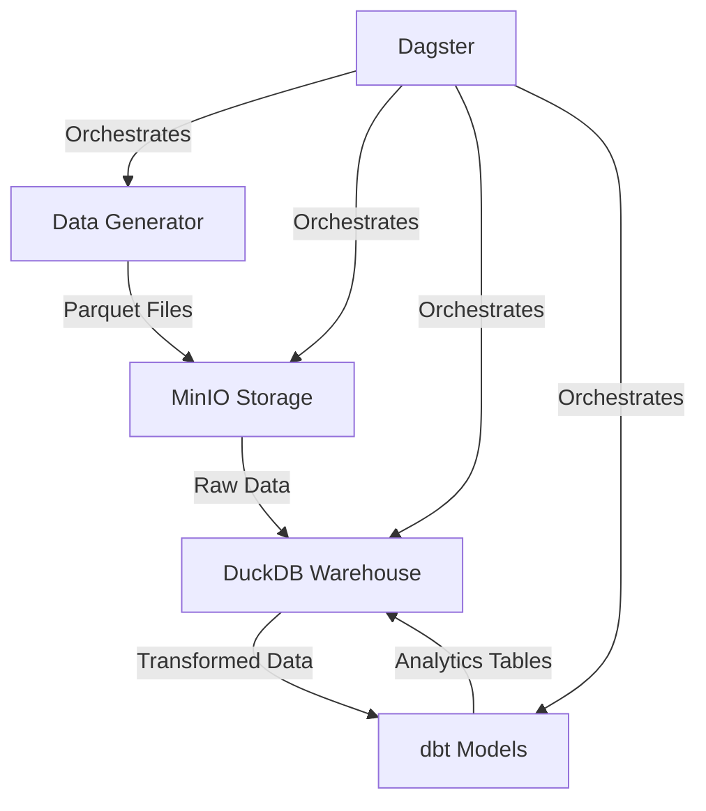

# Project Overview

This project was inspired by Joseph M (Start Data Engineering)'s prompt on an e-commerce POC, so I implemented this assuming I was working on *Nike's E-commerce Market Attribution" the goal is to understand etl incremental batch loading with the use of MinIO for storage, DuckDB for processing engine, dbt for incremental modelling, and Dagster for orchestration.

We will answer questions based on this business case:

## Architecture Overview



## Tools Used

| Tool Name | Use | Reason for Use |
|-----------|-----|----------------|
| MinIO | Object Storage | - S3-compatible storage <br>- Efficient for Parquet files<br>- Supports versioning and CDC<br> |
| DuckDB | Data Warehouse | - In-process analytical database<br>- Fast SQL queries<br>- Great for analytical workloads<br>- Simple setup and maintenance |
| dbt | Data Transformation | - SQL-based transformations<br>- Built-in testing and documentation<br>- Incremental processing support<br>- Modular and maintainable code |
| Dagster | Orchestration | - Pipeline dependency management<br>- Built-in monitoring and logging<br>- Easy scheduling and retries<br>- Great developer experience |
| Docker | Containerization | - Consistent environments<br>- Easy deployment<br>- Isolates services<br>- Simple development setup |
| Metabase | Analytics | - Analyse the ecommerce nike data from dbt-duckdb 

## Requirements

- Docker installed on your computer
- Python 3.10+
- Knowledge of Python and SQL

## How to Run

1. Start the services:

   ```sh
   docker compose up --build -d
   ```

2. Generate sample data:

   ```sh
   python data-generator/create_data.py
   ```

3. Run the dbt models:

   ```sh
   dbt run
   ```

4. Access the Dagster UI:

   ```sh
   dagster dev
   ```

## Project Structure

- `docker-compose.yml`: Defines MinIO and other service configurations
- `data-generator/`: Contains data generation scripts
- `dbt_project/`: dbt models for data transformation
- `dagster/`: Dagster pipeline definitions
- `requirements.txt`: Lists Python package dependencies

## Lessons Learned

1. **Data Versioning**
   - Importance of tracking data lineage
   - Managing incremental updates
   - Handling CDC effectively

2. **Modern Data Stack**
   - Benefits of using specialized tools
   - Integration between components
   - Performance considerations

3. **Best Practices**
   - Modular code organization
   - Testing and documentation
   - Error handling and monitoring
